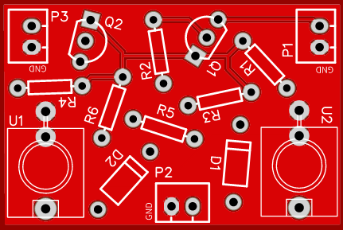
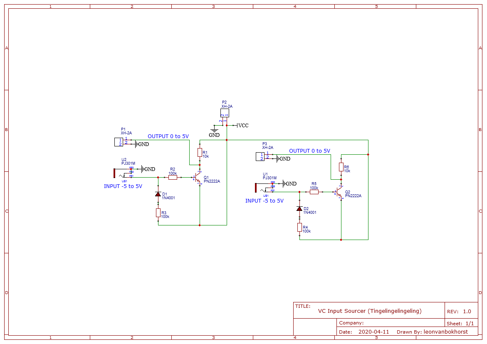

# VC Input Source Protection

Dual transistor based input protection from Eurorack CV to a digital pin on e.g. Arduino.

## Schematic

## BOM

|ID   |Name        |Designator   |Quantity|Manufacturer Part|Manufacturer                  |Supplier|Supplier Part  |
|-----|------------|-------------|--------|-----------------|------------------------------|--------|---------------|
|1    |10k         |R1,R6        |2       |                 |                              |        |               |
|2    |100k        |R2,R3,R4,R5  |4       |                 |                              |        |               |
|3    |1N4001      |D1,D2        |2       |1N4001           |LRC                           |LCSC    |C82804         |
|4    |XH-2A       |P1,P2,P3     |3       |XH-2A            |BOOMELE                       |LCSC    |C20079         |
|5    |PN2222A     |Q1,Q2        |2       |PN2222ATA        |ON Semiconductor / Fairchild  |Mouser  |512-PN2222ATA  |
|6    |PJ301M      |U2,U1        |2       |PJ301M           |thonk                         |        |PJ301M         |